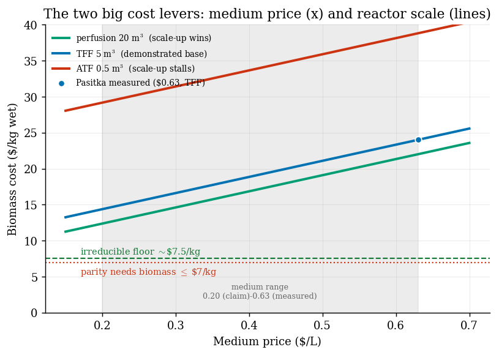
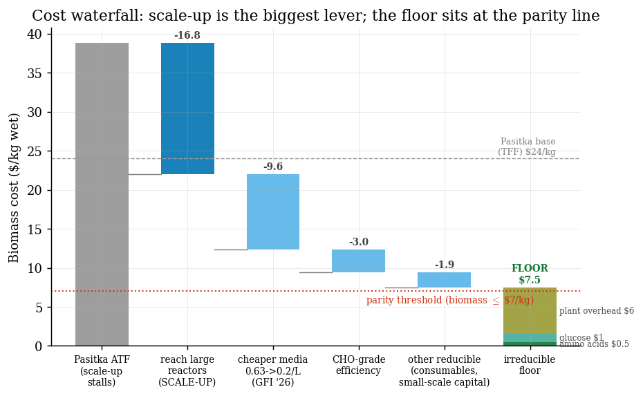
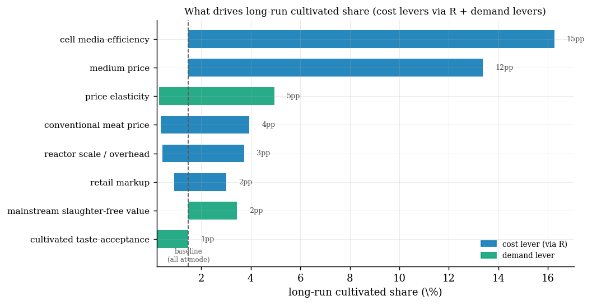
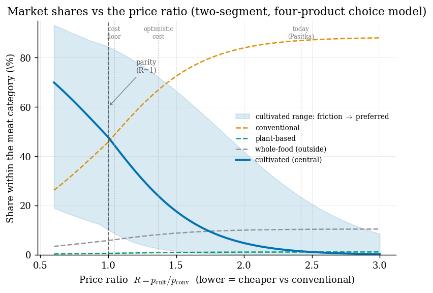
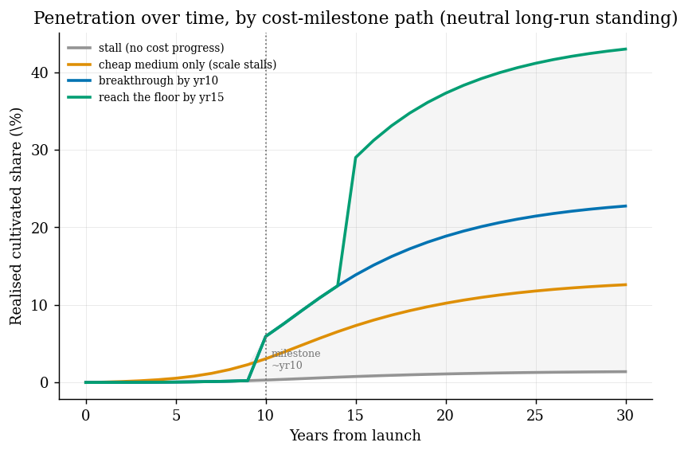
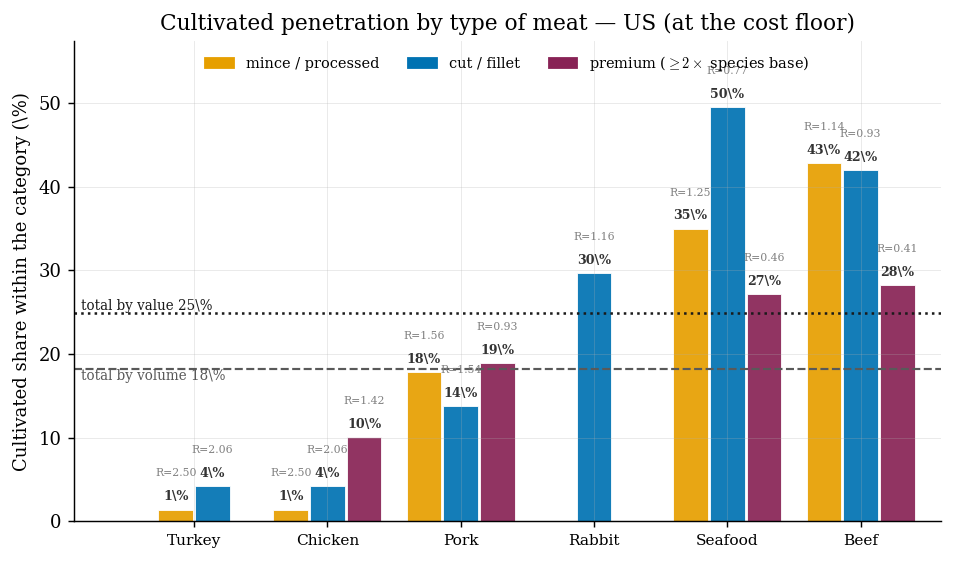
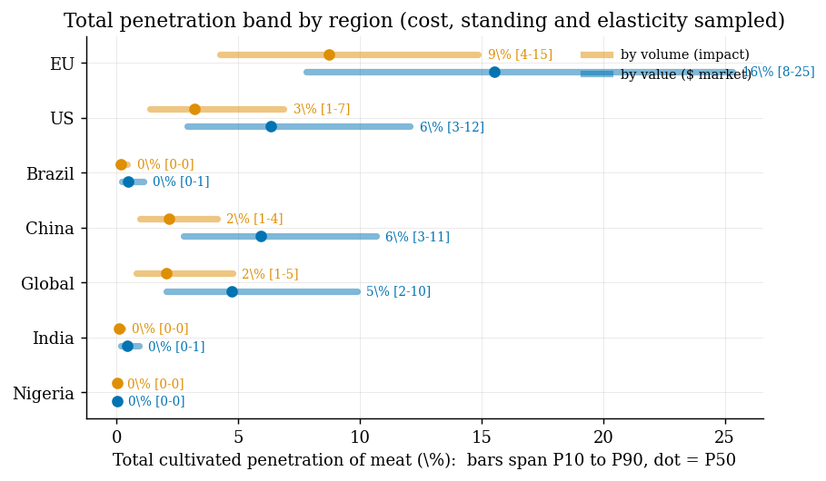

# How far does cultivated meat actually get? A levers-and-bottlenecks model

*A techno-economic + adoption model that asks two questions a funder cares about: how cheap can
cultivated meat plausibly get, and how many animals would that displace? Built on the one empirical
TEA (Pasitka et al., Nature Food 2024) and the physical feedstock floor (Humbird 2021). Every number
is sourced and reproducible; methods in [METHODS.md](METHODS.md), full results in
[RESULTS.md](RESULTS.md).*

---

## Summary

- **The medium-cost breakthrough is real but doesn't reach parity by itself.** Anchored to the one
  empirical TEA, the basic (minced) product most likely lands at a price ratio **R ≈ 2.0 ×
  conventional meat** (80% CI ~1.6–2.4) — consistent with Pasitka's own published projections. The
  ~10× medium-cost reduction moves R from ~2.4 to ~1.6; it does not, on its own, cross parity.
- **The binding cost lever is reactor scale-up, not the medium.** Across the honest input range,
  reactor scale/overhead is the biggest *realised* driver of the price ratio; the medium price — the
  number most often touted — is centered on its measured value and contributes little to the expected
  spread. Scale-up is also the least-demonstrated step (the cheap projections assume reactors nobody
  has built) and carries the largest downside.
- **The irreducible floor sits right at the parity line (~$7.5/kg biomass vs a ~$7/kg threshold).**
  Parity is reachable in principle, but only if the optimistic end of *every* lever lands together,
  *and* the scale-up ceilings are engineered away.
- **Even at parity, how many animals get displaced depends on two uncertain dials** — whether the
  mainstream credits cultivated as real meat (taste-acceptance) and whether it comes to value
  no-slaughter/cleaner meat. Together they span friction (~12%), equivalent (≈49% at parity), and
  actively preferred (~72%). We take no baked-in stance.
- **Total displacement is modest in the central case (~3% of meat by volume; the EU, with the priciest
  meat, ~8%), and the most robust entry point is the structured cuts.** Cheap mince is unreachable on
  price; ultra-luxury is price-cheap but demand-capped, staying below the cuts; the window is beef
  steak and salmon fillet. The EU is the easiest market.

**So-what for funders:** the marginal dollar should target the *binding* constraint — large-volume
bioreactor scale-up and independent at-scale facility-cost data — not another medium-chemistry win,
which is already a company-claimed success.

---

## 1. What the model is

It is a chain, computed **per type of meat** — because cultivated cost is roughly constant across
species (it's animal cells in a bioreactor) while conventional price ranges ~5× (cheap chicken to
sushi):

> **biomass cost → retail price ratio `R` → market share → total penetration**

Two outputs, deliberately of different trust levels:

- **Output 1 — the price ratio `R` = cultivated retail price / conventional price.** *High-trust:* a
  TEA-grounded cost projection over a *known* market price. All the leverage is here.
- **Output 2 — the market share** that `R` buys, rolled up across meat types. *Softer:* a calibrated
  demand model on transplanted plant-based elasticities. Always a band, never a point estimate.

A discipline worth stating up front, because it is the fairest critique of any single TEA: the cost
priors are **centered on Pasitka's measured values** (medium $0.63/L, their cells). Cheaper medium,
more-efficient cells and bigger reactors are the *optimistic tail* — never assumed into the central
case. So "central" = what is demonstrated today; improvements are upside.

---

## 2. The cost side: levers and the bottleneck

Cultivated biomass cost is `medium + overhead`. The two dominant inputs are the **medium price** and
the **reactor scale** (which sets overhead). Here is how they set the cost, with the irreducible
floor for reference:



Three things to read off it: (1) even the best case — large-scale perfusion *and* the company-claimed
$0.20/L medium — lands around $11/kg, still well above the ~$7/kg parity threshold; (2) the spread
*between* the reactor configs (the gap between the lines) is larger than the spread along the medium
axis; (3) the floor is a floor — nothing here reaches it.

The same story as a waterfall — what you'd have to remove to get from the scale-up-stall case down to
the irreducible floor:



**Reactor scale-up is the single biggest step (~$17/kg).** The medium cut ($0.63→$0.20/L) is ~$10/kg.
And the floor itself is *feedstock + minimal plant overhead* — amino acids (~$0.5/kg, comparable to
chicken feed, no order-of-magnitude advantage), bulk glucose (~$1/kg), and plant overhead (~$6/kg).

Ranking every input by how much it moves the *final share* (the cost levers act through `R`; the
variance column is the realised contribution to the Monte-Carlo band):



The honest nuance: medium price and cell efficiency have *large potential swings* but *small realised
contributions*, precisely because we center them on the measured values — they are upside, not
expected movement. **Reactor scale-up and the conventional meat price lead the realised spread.**

### Where the price ratio lands

Propagating the full input uncertainty (Monte Carlo, N = 20,000):

```
basic product vs commodity meat:
  price ratio R:   P50 = 1.98   80% CI [1.61, 2.39]   90% CI [1.51, 2.52]
  0% of draws reach parity (R ≤ 1)
```

This is neither a hype number nor a doom number — it is squarely consistent with Pasitka's own
projections (R ≈ 2.25–2.42 at their medium price), pulled slightly lower by the priced-in
improvements. **Hard constraints vs current-tech assumptions:** the feedstock floor and bioreactor
mass-transfer limits are physical; the $0.20/L medium is a *company self-report* (GFI 2026), and
CHO-grade cell efficiency is a different cell line — both are assumptions, not measurements.

---

## 3. The demand side: from price to share

Given a price ratio, what share does it buy? This is the softer half, so the output is always a band.
The demand model is a **willingness-to-pay curve**: cultivated's share at price ratio `R` is the
fraction of buyers whose reservation price clears it. It is calibrated so that, with cultivated absent,
plant-based meat sits at its real ~1.5% floor — and so that a new cultivated product draws from
**conventional**, not the veggie burger.



Two gates decide the whole picture:

- **Gate 1 — does cost reach parity?** (cost-side, dominates). Because the achievable `R` most likely
  sits above parity, this gate alone yields the low-share world for most of the distribution.
- **Gate 2 — at parity, how do consumers treat lab-grown real meat?** Two meaningful dials are the
  widest lever on the *at-parity* outcome: **taste-acceptance** (is cultivated credited as real
  meat? — the friction) and the **mainstream's value of slaughter-free** (does it come to prefer
  cleaner / no-slaughter meat? — the upside):

| dial | cultivated share | reading |
|---|---|---|
| taste-acceptance 0.6 | ~12% | strong friction (not credited as real meat) |
| taste-acceptance 0.8 | ~27% | modest friction |
| **accepted as real meat (neutral)** | **~49%** | the default we assume nothing beyond |
| + mainstream values no-slaughter (0.5) | ~61% | cleaner / no-slaughter / safety pull |
| + values no-slaughter (1.0) | ~72% | |

We take **no baked-in stance** on gate 2 — it is the reader's to set. The tens-of-percent world needs
cost at parity *and* (real-meat acceptance *or* a clean-meat preference).

**How it unfolds over time.** A static share is a *ceiling*; reaching it takes a rollout (years to get
on every shelf) and growing acceptance (the novelty penalty fading), while cost itself steps down only
as scale-up / cheaper-medium milestones land. Driving the adoption simulation with a few discrete
**cost-milestone paths** gives the trajectory — low and flat if cost stalls, rising after a
breakthrough year:



---

## 4. Penetration by type of meat — price and demand run opposite

Because cost is ~constant but price is not, cultivated's share differs sharply by meat type. This is
the most decision-relevant view:



**There is no easy entry point:** cheap mince is unreachable on price (R ≫ 1, left); ultra-premium
sushi and wagyu are price-cheap but demand-resistant (authenticity, price-insensitivity), so even at
the deepest discounts the standing penalty caps them around ~30% of the category; the most reliable
window is the **structured cuts — salmon fillet (~54%, the single best), beef steak (~44%)** — where
price is reachable and the demand penalty is moderate. Cultivated is cheapest exactly where demand
resists most, and most accepted where it is hardest to beat on price — the mid-cuts clearly out-draw
the demand-capped ultra-premium, so the structured cuts are the robust entry window.

A note on what "penetration" means here: each **bar** is cultivated's share *within* that category (a
quantity/weight share — within one category price is fixed). The **totals** roll up two ways: **by
volume** (weight → animal & climate impact) and **by value** ($ → market capture). They differ because
cheap mince is a big share of weight but a small share of value.

---

## 5. Total penetration, by region

Rolling up across the whole spectrum, sampling cost + standing + elasticity:



```
total cultivated penetration of meat (central / P50, with 80% bands):
  region   by VOLUME (impact)        by VALUE ($ market)
  US       2.8%  [1.2,  6.1]          5.1%  [2.3,  9.9]
  EU       8.0%  [3.5, 15.2]         13.8%  [6.2, 25.1]   ← easiest (priciest meat)
  China    2.6%  [1.1,  5.6]          6.0%  [2.8, 11.4]
  global   2.9%  [1.2,  6.4]          5.3%  [2.3, 10.7]
```

The **EU is easiest** — its meat is the most expensive, so parity is nearest. The US, China and the
global average are harder, dragged down by cheap mince (~60% of volume, unreachable on price). Bands
are wide and right-skewed: the low end is the scale-up-stalls / friction world; the long tail is the
scale-up-wins / actively-preferred world.

One place parity is reachable today is a **structured product vs premium seafood** (the
Wildtype/BlueNalu bet): vs sushi salmon, R is below parity in ~90% of draws — but there the lone new
unknown, the **scaffold process cost**, is ungrounded in any TEA, and premium demand is hostile.

---

## 6. What a technical funder should prioritise

The model points the marginal dollar at the *binding* constraint, not the most visible one:

1. **Reactor scale-up is the binding cost lever** — biggest realised driver, least demonstrated,
   largest downside. Demonstrating large-volume animal-cell perfusion (CO₂/O₂ transfer, shear,
   sterility at scale) beats further medium-chemistry wins.
2. **Plant overhead at scale** (the largest floor term) sets where the floor lands relative to
   parity — fund independent, at-scale facility-cost data. The GFI 2026 report itself flags this as
   the field's central data gap.
3. **Medium price is already a company-claimed success** — verify the sub-$0.20/L claims rather than
   re-fund them; centered on the measured $0.63 it is upside, not the expected path.
4. **`p_conv` is a policy lever:** a meat tax moves `R` toward parity as much as a major cost win,
   and it is exogenously controllable.
5. **The scaffold process cost** is the single biggest *unmeasured* number and gates the
   premium-seafood path — a scaffolding TEA is the literature's clearest hole.

These are disproportionately **public-goods-shaped** (at-scale demonstration, independent TEAs,
scaffolding cost) — underfunded by industry, a good fit for philanthropy.

---

## 7. Cruxes — what would change the conclusion

- **Up:** a peer-reviewed demonstration of animal-cell perfusion at ≥20,000 L holding density and
  sterility → collapses the scale-up downside and pulls the central `R` toward parity. Independent
  confirmation of sub-$0.30/L medium *at scale* → moves the medium lever from upside into the centre.
- **Down:** if the scale-up ceilings (CO₂-limited vessel volume, clean-room cost) prove binding, the
  floor is unreachable at any medium price, and `R` stays ~3+ — the ATF small-vessel world.
- **On demand:** the acceptance dials (taste-acceptance, and the mainstream's value of slaughter-free)
  are genuinely unidentified until cultivated is on shelves. The honest position is to carry the full
  ~12%→72% at-parity range and let each reader set it.

The model does **not** force a pessimistic answer. It says the outcome is governed by two gates and
flags the pivotal parameters rather than picking a side — and it makes explicit which lever
(scale-up) the field's own optimism quietly rests on.

---

### Appendix — the key parameters (full datasheet in `inputs.py`)

| parameter | central | range | source | controls |
|---|---|---|---|---|
| conventional meat price | $12/kg | 10–14 | market | parity threshold; meat-tax lever |
| retail markup (additive) | $5/kg | 4–7 | assumed | parity needs biomass ≤ $7/kg |
| reactor scale / overhead | $9.9/kg | 6–15 (downside 24.7) | Pasitka Fig.4 | the scale-up bottleneck |
| medium price | $0.63/L | 0.20–0.63 | Pasitka measured / GFI'26 claim | medium cost (centered on measured) |
| cell media-efficiency | 1.0× | 0.25–1.0 | Pasitka / CHO | cell efficiency (centered on measured) |
| consumer standing at parity | 0 | −2 … +1 | the dial | gate 2 (the ~12%↔72% question) |
| price elasticity (of meat) | −0.9 | −1.4 … −0.5 | scanner data | demand response to price |
| cultivated price-sensitivity (κ) | 3× | (fixed) | assumed | cultivated vs meat elasticity (close substitute) |
| scaffold process cost | $5/kg | 1–15 | ungrounded | premium structured products only |

**Sources.** Pasitka et al. 2024 (*Nature Food*) — the empirical TEA and the three reactor configs.
Humbird 2021 — the amino-acid feedstock floor and the physical scale-up constraints. GFI 2026 State
of the Industry — company-reported medium costs (tagged as unverified). Full method, equations and
provenance: [METHODS.md](METHODS.md); full numbers: [RESULTS.md](RESULTS.md).
